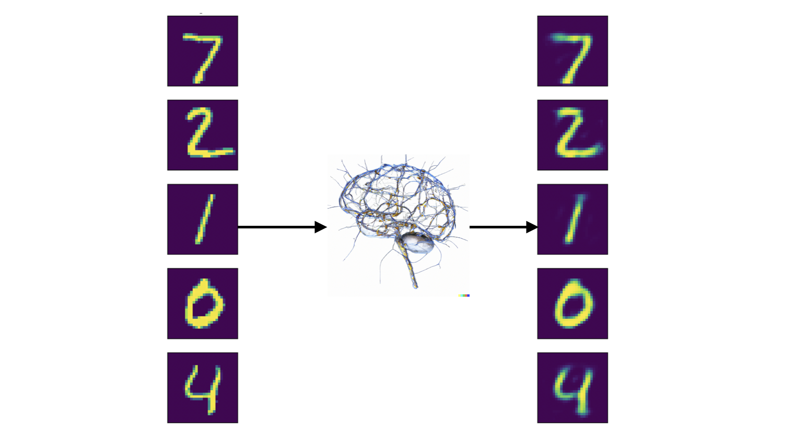
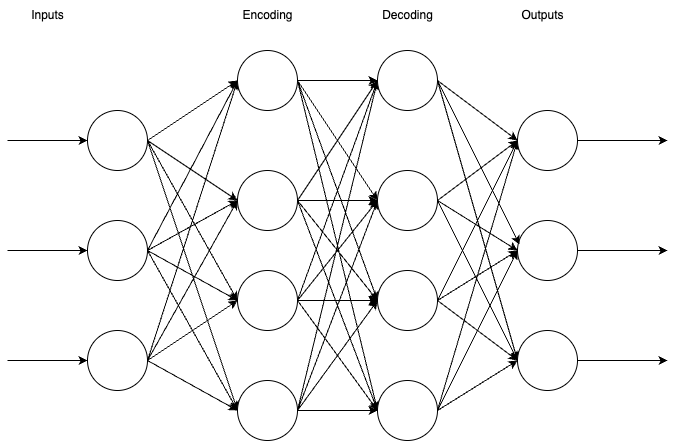
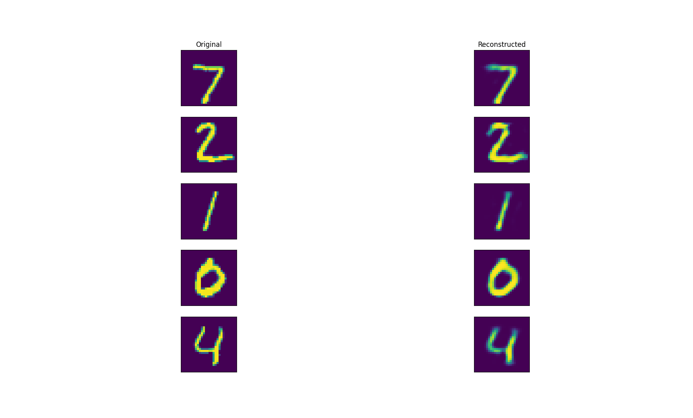

# Autoencoders: An intro and building your first one

## Introduction - What are autoencoders?

Autoencoders are a fundamental concept in machine learning, particularly in 
the field of neural networks. Think of them as clever tools that help us 
compress and then expand data, like squeezing and stretching a rubber ball. 
Here's a simple way to grasp what autoencoders do:

Imagine you have a collection of images, but you want to reduce their size 
while keeping the important details intact. Autoencoders can help with this. 
They consist of two parts: an encoder and a decoder. The encoder shrinks the 
image, like squishing it into a tiny version, which represents the compressed 
information. Then, the decoder takes this compact representation and tries 
to expand it back into the original image. The magic happens in the training 
process, where the autoencoder learns to do this compression and decompression 
efficiently, finding a balance between keeping the essential features and 
reducing the size. This makes them handy for tasks like image compression, 
denoising, and feature extraction.



Autoencoders aren't just limited to images; they can work with various types 
of data, like text or numerical values. Think of them as a versatile tool to 
uncover patterns and reduce data complexity. By teaching an autoencoder to 
compress and then expand your data effectively, you enable it to learn valuable 
representations, making it a useful addition to your machine learning toolbox. 
Whether you're interested in reducing data dimensions or extracting meaningful 
features, autoencoders are a powerful technique to explore and understand.

## Building your first autoencoder
So, now that we know what an autoencoder is, how do we build it? We can think of
an autoencoder as a neural network itself with an input layer, encoding layer, 
decoding layer, and then an output layer.

In our basic example, we are going to build one with just a single encoder 
and decoder layer and then we will feed some standard images into it. 

In the end, we will have something which closely resembles the diagram below:



## Step 1 - A simple autoencoder

First, let's import our necessary libraries:

```python
from keras.layers import Dense
from keras import (
    Input,
    Model
)
from keras.datasets import mnist
import numpy as np
import matplotlib.pyplot as plt
from dataclasses import dataclass
from typing import Tuple

```

We will be using:

* Keras as our machine learning library and for things like
    layers, neural network inputs, datasets, etc.
* Numpy for array / matrix operations
* Matplotlib to display results
* Typing for type hints

All dependencies can be found in the [requirements.txt]().

Next, let's create a function to build our autoencoder:

```python
def generate_auto_encoder(dimensions: int = 32, image_shape: Tuple[int] = (3072, )) -> Model:
    """Builds an Autoencoder object given the encoded image dimensions
    and the original image shapes

    Arguments:
        dimensions (int): The size of our encoded image representations
        image_shape (tuple(int)): The size and shape of our input images
    
    Returns:
        autoencoder (Model): A full autoencoder representation
    """
    # Original Input Image, will be subsequently fed into our encoding layer
    inputs = Input(shape=image_shape)

    # The single encoding layer which will output the encoded (compressed)
    # representation of our input image
    encoded_layer = Dense(dimensions, activation='relu')(inputs)

    # The single decoding layer which will output a reconstructed image
    # from the compressed output of the encoded_layer
    decoded_layer = Dense(image_shape[0], activation='sigmoid')(encoded_layer)

    # The full autoencoder
    autoencoder = Model(inputs=inputs, outputs=decoded_layer)
    autoencoder.compile(optimizer='adam', loss='binary_crossentropy')
    return autoencoder
```

This function is relatively simple, actually! Let's see what we are doing.
First, we create an input image using the `keras.Input` object. This will be 
the original image that we want our autoencoder to break down and reconstruct. 

Next, we create an encoding layer using `keras.layers.Dense`. The encoded layer
will output image representations that are `dimensions` in size (for example, 32 units).
It will also use `relu` as its activation layer. Finally, we just pass it the input object
as input, essentially connecting an input layer to a encoding layer. 

Now, we need to make the decoding layer. We want the output dimensions of the 
decoding layer to be the same dimensions of the original image, so we will use 
whatever our original image size was. We will also use `sigmoid` as the activation 
function here, and then pass it the encoded layer as input. Again, connecting the 
two layers. Finally, we can put everything together in a `keras.Model` object with 
the original input as the model's input and the output of the decoding layer as the 
model's output. Finally, we can just compile the model and return our new autoencoder.

Now that we have some function to create an autoencoder, we need to grab some input data,
generate and train our autoencoder, and then do some visual testing to see what
it actually does! Let's first load our mnist data and normalize it for our model (if you're
curious about _why_ to normalize data, here's a great 
[medium post](https://towardsdatascience.com/why-data-should-be-normalized-before-training-a-neural-network-c626b7f66c7d)):

```python
def main():
    # Some standard settings
    epochs     = 50  # number of epochs to run
    batch_size = 256 # training batch size
    n_digits   = 5   # number of images to show on output graph

    # loading in our mnist dataset - https://keras.io/api/datasets/mnist/
    (x_train, _), (x_test, _) = mnist.load_data()

    # save original shape of image before reshaping array
    x_train_shape_orig = x_train.shape

    # normalize the image values between 0 and 1 and then flatten them
    # into an input vector
    x_train = x_train.astype('float32') / 255.
    x_test = x_test.astype('float32') / 255.
    x_train = x_train.reshape((len(x_train), np.prod(x_train.shape[1:])))
    x_test = x_test.reshape((len(x_test), np.prod(x_test.shape[1:])))

```

So, we see that we use the `keras.datasets.mnist` dataset as our dataset. We can
load it right into our `x_train` and `x_test` variables just by using `load_data()`.
Then, we normalize the values between 0 and 1 and reshape them into vectors of the size
of the image (784 for mnist because images are 28x28 and 28 * 28 = 784).

Next, we can go right into our encoder generation and training:
```python
    # generate our untrained autoencoder
    image_shape = (x_train.shape[1],)
    autoencoder = generate_auto_encoder(image_shape=image_shape)

    # fit/train our autoencoder to the training data
    autoencoder.fit(
        x_train, x_train,
        epochs=epochs,
        batch_size=batch_size,
        shuffle=True,
        validation_data=(x_test, x_test)
    )
```

We used our `generate_auto_encoder` function from before to generate us an autoencoder!
Then, we trained the model using the keras API on the training mnist data for a set
number of epochs using a set batch size. At this point, we can now go and manually
validate how our autoencoder does at deconstruction and reconstruction of images:

```python
    # Using our autoencoder, reconstruct the test data from
    # the mnist dataset
    decoded_imgs = autoencoder.predict(x_test)

    # display the outupts so we can see the original vs reconstructed
    # images
    plt.figure(figsize=(20, 4))
    counter = 0
    for i in range(n_digits):
        # Original
        ax = plt.subplot(n_digits, 2, counter + 1)
        plt.imshow(x_test[i].reshape(x_train_shape_orig[1], x_train_shape_orig[2]))
        ax.get_xaxis().set_visible(False)
        ax.get_yaxis().set_visible(False)
        if (counter == 0):
            plt.title("Original")

        # Reconstructed
        ax = plt.subplot(n_digits, 2, counter + 2)
        plt.imshow(decoded_imgs[i].reshape(x_train_shape_orig[1], x_train_shape_orig[2]))
        ax.get_xaxis().set_visible(False)
        ax.get_yaxis().set_visible(False)
        if (counter == 0):
            plt.title("Reconstructed")
        counter += 2
    plt.show()
```

First, we call `autoencoder.predict()` on our testing data to deconstruct and reconstruct
each image in our testing dataset. Then, we use `matplotlib` to plot the original images
on the left side of the plot and the reconstructed images on the right side of the plot.

Finally, let's give this thing a run to see:
* An example output in the terminal
* What the reconstructed images look like

```shell
prompt> python autoencoder/simple.py  
Epoch 1/50
235/235 [==============================] - 1s 4ms/step - loss: 0.2759 - val_loss: 0.1870
Epoch 2/50
235/235 [==============================] - 1s 3ms/step - loss: 0.1689 - val_loss: 0.1529
Epoch 3/50
235/235 [==============================] - 1s 4ms/step - loss: 0.1437 - val_loss: 0.1337
Epoch 4/50
235/235 [==============================] - 1s 3ms/step - loss: 0.1286 - val_loss: 0.1214
Epoch 5/50
235/235 [==============================] - 1s 3ms/step - loss: 0.1183 - val_loss: 0.1131
Epoch 6/50
235/235 [==============================] - 1s 3ms/step - loss: 0.1111 - val_loss: 0.1069
Epoch 7/50
235/235 [==============================] - 1s 3ms/step - loss: 0.1059 - val_loss: 0.1025
Epoch 8/50
235/235 [==============================] - 1s 3ms/step - loss: 0.1021 - val_loss: 0.0998
Epoch 9/50
235/235 [==============================] - 1s 3ms/step - loss: 0.0995 - val_loss: 0.0971
Epoch 10/50
235/235 [==============================] - 1s 3ms/step - loss: 0.0976 - val_loss: 0.0956
Epoch 11/50
235/235 [==============================] - 1s 3ms/step - loss: 0.0964 - val_loss: 0.0946
Epoch 12/50
235/235 [==============================] - 1s 3ms/step - loss: 0.0956 - val_loss: 0.0939
Epoch 13/50
235/235 [==============================] - 1s 4ms/step - loss: 0.0950 - val_loss: 0.0934
Epoch 14/50
235/235 [==============================] - 1s 3ms/step - loss: 0.0946 - val_loss: 0.0931
Epoch 15/50
235/235 [==============================] - 1s 3ms/step - loss: 0.0943 - val_loss: 0.0928
Epoch 16/50
235/235 [==============================] - 1s 3ms/step - loss: 0.0940 - val_loss: 0.0926
Epoch 17/50
235/235 [==============================] - 1s 3ms/step - loss: 0.0939 - val_loss: 0.0924
Epoch 18/50
235/235 [==============================] - 1s 3ms/step - loss: 0.0937 - val_loss: 0.0923
Epoch 19/50
235/235 [==============================] - 1s 3ms/step - loss: 0.0936 - val_loss: 0.0922
Epoch 20/50
235/235 [==============================] - 1s 3ms/step - loss: 0.0934 - val_loss: 0.0921
Epoch 21/50
235/235 [==============================] - 1s 4ms/step - loss: 0.0934 - val_loss: 0.0920
Epoch 22/50
235/235 [==============================] - 1s 4ms/step - loss: 0.0933 - val_loss: 0.0920
Epoch 23/50
235/235 [==============================] - 1s 4ms/step - loss: 0.0932 - val_loss: 0.0919
Epoch 24/50
235/235 [==============================] - 1s 4ms/step - loss: 0.0932 - val_loss: 0.0918
Epoch 25/50
235/235 [==============================] - 1s 4ms/step - loss: 0.0931 - val_loss: 0.0918
Epoch 26/50
235/235 [==============================] - 1s 4ms/step - loss: 0.0930 - val_loss: 0.0918
Epoch 27/50
235/235 [==============================] - 1s 3ms/step - loss: 0.0930 - val_loss: 0.0917
Epoch 28/50
235/235 [==============================] - 1s 4ms/step - loss: 0.0929 - val_loss: 0.0917
Epoch 29/50
235/235 [==============================] - 1s 4ms/step - loss: 0.0929 - val_loss: 0.0917
Epoch 30/50
235/235 [==============================] - 1s 3ms/step - loss: 0.0929 - val_loss: 0.0918
Epoch 31/50
235/235 [==============================] - 1s 3ms/step - loss: 0.0929 - val_loss: 0.0916
Epoch 32/50
235/235 [==============================] - 1s 3ms/step - loss: 0.0928 - val_loss: 0.0916
Epoch 33/50
235/235 [==============================] - 1s 3ms/step - loss: 0.0928 - val_loss: 0.0916
Epoch 34/50
235/235 [==============================] - 1s 3ms/step - loss: 0.0928 - val_loss: 0.0917
Epoch 35/50
235/235 [==============================] - 1s 4ms/step - loss: 0.0928 - val_loss: 0.0915
Epoch 36/50
235/235 [==============================] - 1s 4ms/step - loss: 0.0927 - val_loss: 0.0916
Epoch 37/50
235/235 [==============================] - 1s 4ms/step - loss: 0.0927 - val_loss: 0.0915
Epoch 38/50
235/235 [==============================] - 1s 4ms/step - loss: 0.0927 - val_loss: 0.0914
Epoch 39/50
235/235 [==============================] - 1s 4ms/step - loss: 0.0927 - val_loss: 0.0915
Epoch 40/50
235/235 [==============================] - 1s 4ms/step - loss: 0.0927 - val_loss: 0.0915
Epoch 41/50
235/235 [==============================] - 1s 4ms/step - loss: 0.0926 - val_loss: 0.0914
Epoch 42/50
235/235 [==============================] - 1s 4ms/step - loss: 0.0926 - val_loss: 0.0914
Epoch 43/50
235/235 [==============================] - 1s 4ms/step - loss: 0.0926 - val_loss: 0.0914
Epoch 44/50
235/235 [==============================] - 1s 4ms/step - loss: 0.0926 - val_loss: 0.0914
Epoch 45/50
235/235 [==============================] - 1s 4ms/step - loss: 0.0926 - val_loss: 0.0915
Epoch 46/50
235/235 [==============================] - 1s 4ms/step - loss: 0.0926 - val_loss: 0.0914
Epoch 47/50
235/235 [==============================] - 1s 4ms/step - loss: 0.0926 - val_loss: 0.0914
Epoch 48/50
235/235 [==============================] - 1s 4ms/step - loss: 0.0925 - val_loss: 0.0913
Epoch 49/50
235/235 [==============================] - 1s 4ms/step - loss: 0.0925 - val_loss: 0.0913
Epoch 50/50
235/235 [==============================] - 1s 4ms/step - loss: 0.0925 - val_loss: 0.0913
313/313 [==============================] - 0s 512us/step
```

And an example output can be seen below!


The output images should look _similar_ to the inputs, but you'll notice that they are a bit
blurrier. The features that remain are the features that your autoencoder deemed the most 
important, so there is some loss there (i.e. lossy compression). However, this reduced 
dimensionality can have some benefits to other neural networks that come next in your
image processing/classification pipeline!

## Links
All code can be found [here on github](https://github.com/afoley587/simple-autoencoder)!